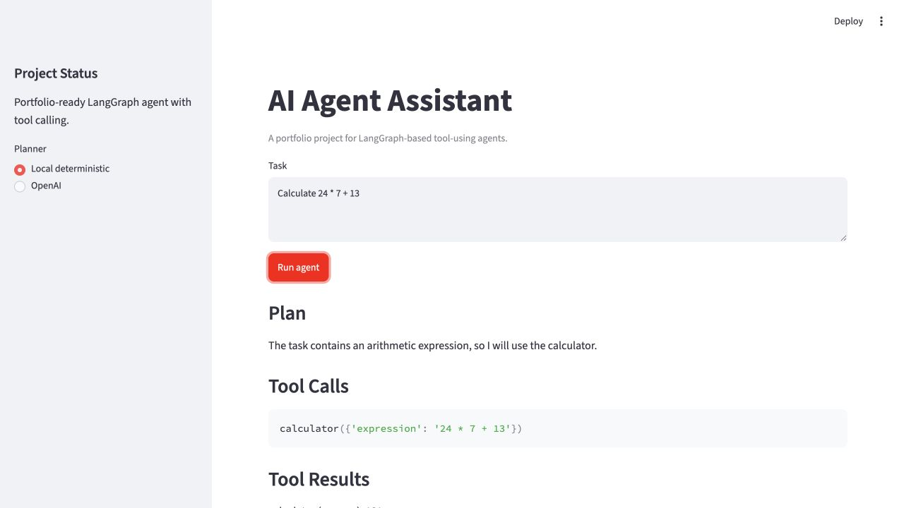
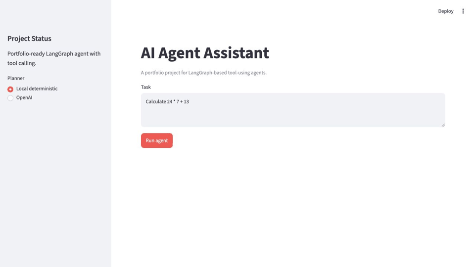

# AI Agent Assistant

[](https://github.com/Tony-QianxiLU/ai-agent-assistant/actions/workflows/ci.yml)
[](https://github.com/Tony-QianxiLU/ai-agent-assistant/releases)
[](https://www.python.org/)
[](https://tony-qianxilu-ai-agent-assistant.streamlit.app/)
[](LICENSE)

A LangGraph-based AI agent assistant that plans a task, calls tools, records execution memory, and returns a structured response through a Streamlit interface.

This project is part of my AI engineering portfolio. It demonstrates practical agent engineering concepts: deterministic planning, optional LLM planning, graph-based orchestration, tool calling, tool error isolation, lightweight memory, testing, CI, deployment, and recruiter-friendly documentation.

## Live Demo

[Open the deployed Streamlit app](https://tony-qianxilu-ai-agent-assistant.streamlit.app/)

## Features

- Plan tasks with a deterministic local planner.
- Optionally use OpenAI for planning when `OPENAI_API_KEY` is configured.
- Execute tool calls through a typed registry.
- Run calculator, summarizer, and todo extraction tools.
- Isolate tool failures so one bad tool call does not crash the agent graph.
- Record lightweight execution memory for task, plan, and tool results.
- Show plan, tool calls, tool results, memory, and final answer in Streamlit.
- Evaluate tool selection, graph trajectory, answer terms, error recovery, latency, and execution logs.
- Test agent behavior without relying on paid API calls.
- Deploy publicly on Streamlit Community Cloud.

## Architecture

```mermaid
flowchart TD
    user["User"] --> ui["Streamlit UI"]
    ui --> planner["Planner"]
    planner --> graph["LangGraph Workflow"]
    graph --> tools["Tool Calling"]
    tools --> memory["Execution Memory"]
    memory --> responder["Response Builder"]
    responder --> output["Structured Response"]
```

## Agent Workflow

```text
User
  |
  v
Planner
  |
  v
Tool Calling
  |
  v
Memory
  |
  v
LLM / Response Builder
  |
  v
Response
```

## Tech Stack

- Python 3.12
- LangGraph
- LangChain OpenAI
- Streamlit
- pydantic-settings
- pytest
- Ruff
- uv
- GitHub Actions

## Folder Structure

```text
ai-agent-assistant/
|-- .github/
|   |-- ISSUE_TEMPLATE/
|   `-- workflows/
|-- docs/
|   |-- demo/
|   |-- images/
|   |-- video/
|   |-- architecture.md
|   |-- deployment.md
|   |-- evaluation.md
|   `-- walkthrough.md
|-- src/
|   `-- ai_agent_assistant/
|       |-- app.py
|       |-- config.py
|       |-- evaluate.py
|       |-- evaluation.py
|       |-- execution_log.py
|       |-- graph.py
|       |-- memory.py
|       |-- planner.py
|       `-- tools.py
|-- tests/
|-- .env.example
|-- pyproject.toml
|-- uv.lock
`-- README.md
```

## Installation

Install `uv` if needed:

```bash
brew install uv
```

Install dependencies:

```bash
uv sync
```

## Environment Variables

Create a local `.env` file from `.env.example`:

```bash
cp .env.example .env
```

Supported variables:

| Variable | Required | Purpose |
| --- | --- | --- |
| `OPENAI_API_KEY` | No | Enables optional OpenAI planning. |
| `OPENAI_MODEL` | No | Chat model used by the OpenAI planner. |

Never commit real API keys.

## Quick Start

Run the Streamlit app:

```bash
PYTHONPATH=src uv run streamlit run src/ai_agent_assistant/app.py
```

Run quality checks:

```bash
uv run ruff check .
uv run pytest
```

Run the agent evaluation suite:

```bash
PYTHONPATH=src uv run agent-evaluate
```

This writes:

- `reports/evaluation-report.md`
- `reports/evaluation-report.json`

## Screenshots



Fallback screenshot:


## Demo GIF



## Walkthrough Video

[Watch the 63-second project walkthrough](docs/video/agent-assistant-walkthrough.mp4)

## Usage

1. Open the app.
2. Keep `Local deterministic` planner selected for a reproducible demo.
3. Enter a task such as a calculation, summarization, or todo extraction request.
4. Run the agent.
5. Inspect the plan, tool calls, tool results, execution memory, and final answer.

## Example Prompts

```text
Calculate 24 * 7 + 13
```

```text
Summarize: Agents can plan tasks, call tools, and return structured results.
```

```text
Create todos from: read the README, run the tests, deploy the app
```

## Example Outputs

Calculation:

```text
Plan: The task contains an arithmetic expression, so I will use the calculator.

Tool results:
calculator (ok): 181
```

Todo extraction:

```text
todo_extractor (ok):
- [ ] read the README
- [ ] run the tests
- [ ] deploy the app
```

Tool error isolation:

```text
calculator (error): Tool error: float division by zero
```

## Evaluation

This project includes an offline agent benchmark that can run without an OpenAI API key. It evaluates whether the agent selects the expected tools, records the expected graph trajectory, returns expected output terms, isolates tool errors, and writes structured execution logs.

Current benchmark report:

| Metric | Result |
| --- | ---: |
| Tool selection accuracy | 100% |
| Trajectory accuracy | 100% |
| Answer terms rate | 100% |
| Error recovery rate | 100% |
| Overall pass rate | 100% |

Run it locally:

```bash
PYTHONPATH=src uv run agent-evaluate
```

See [docs/evaluation.md](docs/evaluation.md) and [reports/evaluation-report.md](reports/evaluation-report.md).

## Interview Preparation

See [docs/interview-prep.md](docs/interview-prep.md) for recruiter explanations, technical questions, architecture questions, system design prompts, STAR stories, and follow-up questions.

## Technical Highlights

- LangGraph makes `plan -> act -> remember -> respond` execution explicit.
- Tool registry keeps tool implementations independent and testable.
- Tool errors are isolated and returned as structured results.
- Local deterministic planning makes CI and demos reliable.
- Optional OpenAI planning is controlled only through environment variables.
- Execution memory records what happened during each run.
- Evaluation reports include tool selection, trajectory, answer terms, error recovery, latency, and execution logs.
- Tests cover planner selection, graph behavior, tool execution, and tool failure paths.

## Deployment

The public demo is deployed on Streamlit Community Cloud.

Suggested Streamlit settings:

- Repository: `Tony-QianxiLU/ai-agent-assistant`
- Branch: `main`
- Main file path: `src/ai_agent_assistant/app.py`
- Python version: `3.12`

Optional secrets:

```toml
OPENAI_API_KEY = "..."
OPENAI_MODEL = "gpt-4.1-mini"
```

## Future Improvements

- Add persistent memory across sessions.
- Add browser/search tools with human approval gates.
- Add richer planner evaluation datasets with task difficulty tiers.
- Add structured JSON output mode.
- Store evaluation reports as CI artifacts.
- Add FastAPI endpoints for backend integration.

## License

This project is released under the MIT License. See [LICENSE](LICENSE).

## Acknowledgements

- LangGraph for graph-based agent orchestration.
- Streamlit for fast AI app deployment.
- OpenAI for optional LLM planning.
