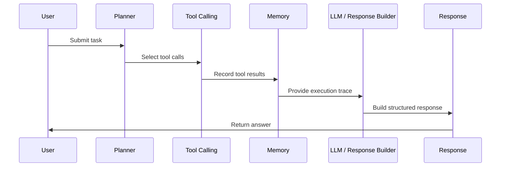

# Architecture

## Goal

AI Agent Assistant demonstrates how a tool-using agent can turn a task into a plan, execute tools through a registry, record execution memory, and return a structured response.

## System Diagram

```mermaid
flowchart TD
    user["User"] --> ui["Streamlit UI"]
    ui --> planner["Planner"]
    planner --> graph["LangGraph StateGraph"]
    graph --> registry["Tool Registry"]
    registry --> calculator["Calculator"]
    registry --> summarizer["Summarizer"]
    registry --> todos["Todo Extractor"]
    calculator --> memory["Execution Memory"]
    summarizer --> memory
    todos --> memory
    memory --> response["Response Builder"]
    response --> user
```

## Agent Workflow



## Graph Nodes

| Node | Responsibility |
| --- | --- |
| `plan` | Select tool calls from the input task. |
| `act` | Run planned tool calls through the registry. |
| `remember` | Record task, plan, and tool results. |
| `respond` | Render final answer from plan and tool results. |

## Design Decisions

- The local planner keeps the project deterministic and testable.
- The OpenAI planner is optional and enabled only through environment variables.
- Tool failures are isolated as `ToolResult(success=False)` instead of crashing the graph.
- Memory is lightweight and per-run, which is appropriate for a public demo.
- Tools are small pure functions so they can be unit tested directly.
